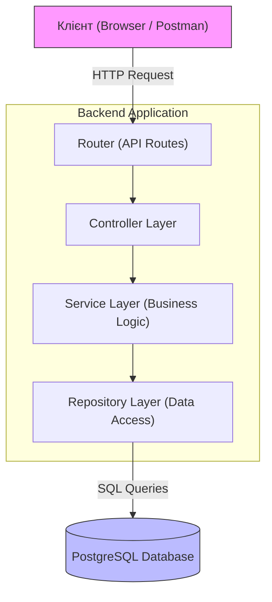
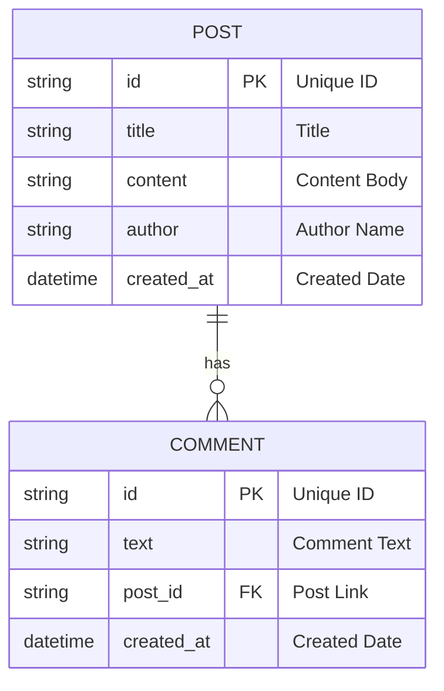

# Архітектура проекту SimpleBlog

Цей документ описує високорівневу структуру бекенд-додатку, схему бази даних та основні потоки даних.

## 1. Компонентна діаграма (High-Level Design)

Додаток побудовано за Шаруватою архітектурою (Layered Architecture). Це забезпечує слабку зв'язність компонентів та легкість у тестуванні.

##    Опис компонентів:
Router (Маршрутизатор): Вхідна точка. Визначає, який контролер має обробити запит.

Controller (Контролер): Приймає дані, валідує їх та викликає бізнес-логіку.

Service (Сервіс): Ядро програми. Тут міститься вся логіка.

Repository (Репозиторій): Шар доступу до даних (SQL).

## 2. Структура Бази Даних (ER Diagram)
Схема даних для реалізації функціоналу блогу

##    Опис сутностей:
POST: Головна сутність. Зберігає контент блогу.

COMMENT: Дочірня сутність. Зв'язана з постом (один пост — багато коментарів).

## 3. Потік даних (Data Flow)
Сценарій "Створення статті":

Клієнт відправляє POST /api/v1/posts.

Router передає запит у PostController.

Controller валідує дані та викликає PostService.

Service виконує бізнес-логіку (наприклад, додає дату) та звертається до PostRepository.

Repository виконує INSERT запит до бази даних.

Сервер повертає успішну відповідь.